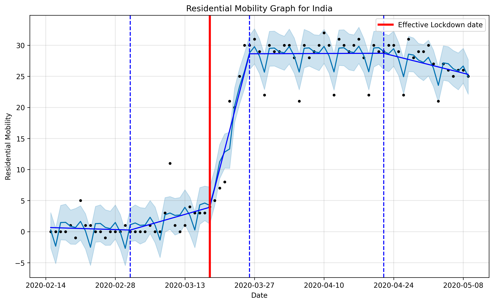

# COVID-19 Lockdown Date Inference

Infer the true lockdown date for a country from the [mobility data](https://www.google.com/covid19/mobility/) published by Google. [Prophet](https://facebook.github.io/prophet/) time-series analysis library was used to identify changepoints.

True lockdown date is defined as the date at which the largest gradient in mobility is registered for a fixed mobility factor (work, residential, etc.)

## Example

#### Australia (Residential Mobility)

Lockdown Date: March 13, 2020

#### India (Residential Mobility)

Lockdown Date: March 18, 2020

## Lockdown Dates inferred from Residential Mobility

* Australia: 2020-03-13
* Brazil: 2020-03-13
* Spain: 2020-03-10
* United Kingdom: 2020-03-13
* India: 2020-03-18
* Italy: 2020-03-05
* South Korea: 2020-02-20
* Sweden: 2020-03-10
* United States: 2020-03-10

## Lockdown Dates inferred from Workplace Mobility

* Australia: 2020-03-15
* Brazil: 2020-03-13
* Spain: 2020-03-10
* United Kingdom: 2020-03-13
* India: 2020-03-18
* Italy: 2020-03-07
* South Korea: 2020-04-22
* Sweden: 2020-03-10
* United States: 2020-03-10

## Lockdown Dates inferred from Retail and Recreation Mobility

* Australia: 2020-03-15
* Brazil: 2020-03-15
* Spain: 2020-03-10
* United Kingdom: 2020-03-15
* India: 2020-03-18
* Italy: 2020-03-07
* South Korea: 2020-02-20
* Sweden: 2020-04-09
* United States: 2020-03-13